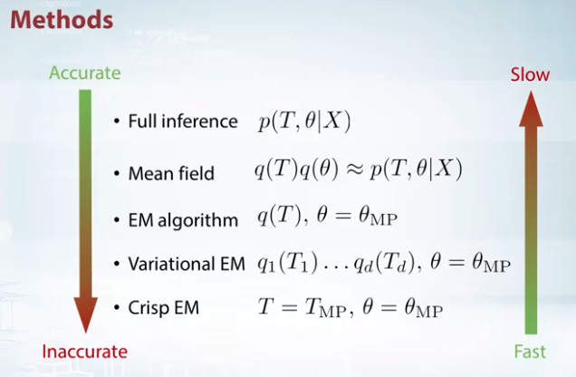

# BayesianMachineLearning

Have Material On Bayesian Methods in Machine Learning. Discusses on inference techniques in Bayesian Settings which typically makes use of latent variables and priors. Will be updated from soon with more info.

